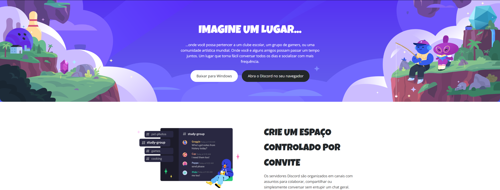

# Clone da Landing Page do Discord

Este é um projeto de front-end que recria a landing page do Discord, desenvolvido com o objetivo de praticar e aprimorar habilidades em HTML5 e CSS3, incluindo o uso de Flexbox e design responsivo.

## 🚀 Visão Geral

O projeto consiste em uma página estática que espelha o design e a estrutura da página inicial do Discord, focando na semântica do HTML e na estilização precisa com CSS.

 

---

## ✨ Funcionalidades

- **Layout Moderno:** Estrutura baseada em Flexbox para um alinhamento flexível e responsivo.
- **Fontes Customizadas:** Utiliza as fontes "Luckiest Guy" para títulos e "Open Sans" para o corpo do texto, importadas do Google Fonts.
- **Design Responsivo:** A página se adapta a diferentes tamanhos de tela, garantindo uma boa experiência tanto em desktops quanto em dispositivos móveis.
- **Estrutura Semântica:** Uso de tags HTML5 semânticas (`<main>`, `<section>`, `<footer>`) para melhor acessibilidade e SEO.

---

## 🛠️ Tecnologias Utilizadas

- **HTML5:** Para a estrutura e conteúdo da página.
- **CSS3:** Para estilização, layout (Flexbox) e responsividade.
- **Google Fonts:** Para a importação e uso de fontes personalizadas.

---

## 📂 Estrutura do Projeto

O projeto está organizado da seguinte forma:

```
clone-discord/
├── index.html          # Arquivo principal da página
├── style.css           # Folha de estilos
├── imgs/               # Pasta com todas as imagens e ícones
│   ├── bg-hero.png
│   ├── chat-group.png
│   ├── logo-discord.svg
│   ├── membros.png
│   ├── video-call.png
│   └── voice-chat.png
└── README.md           # Este arquivo
```

---

## 🏃 Como Executar

Como este é um projeto estático, não há necessidade de instalação de dependências. Basta seguir os passos abaixo:

1. Clone o repositório (se estiver no GitHub):
   ```sh
   git clone https://github.com/seu-usuario/seu-repositorio.git
   ```
2. Navegue até a pasta do projeto.
3. Abra o arquivo `index.html` no seu navegador de preferência.

E pronto! A página será exibida.